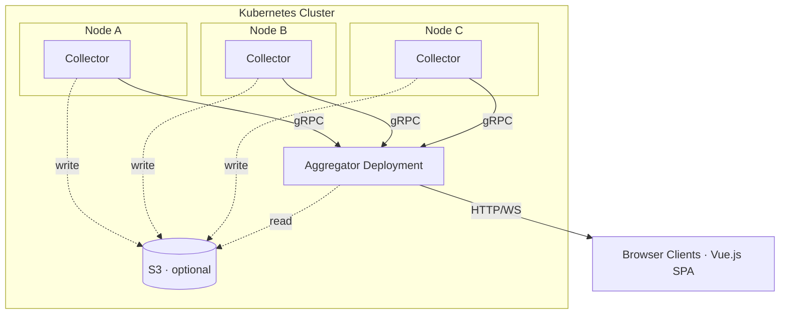

# Flume

[](https://go.dev/dl/)
[](LICENSE)
[](https://hub.docker.com/r/interpt/flume)

Real-time Kubernetes log collector and aggregator. Collects container logs from every node, routes them through label-based patterns, and serves them to browser clients via WebSocket — with optional S3 persistence and automatic retention.

| Light | Dark |
|-------|------|
|  |  |
|  |  |

## Features

- **Kubernetes native** — Collector DaemonSet on every node, central Aggregator Deployment
- **CRI log parsing** — reads `/var/log/containers/` directly, handles partial lines and log rotation
- **Pod label enrichment** — automatically fetches labels from the Kubernetes API
- **Pattern-based routing** — define label selectors to group logs into independent streams
- **Real-time streaming** — logs delivered via WebSocket with configurable batched flush
- **Label-based filtering** — filter by any label in the UI and server-side via WebSocket
- **Pre-filter scoping** — lock a connection to a subset of logs via URL query params
- **Auth callback** — optional external auth service for WebSocket authorization
- **S3 persistence** — time-partitioned gzipped JSON storage with per-hour manifests
- **Automatic retention** — configure a TTL and Flume deletes expired S3 data hourly
- **JSON detection** — structured log lines are parsed and rendered as collapsible JSON trees
- **Ring buffer** — configurable in-memory history per pattern; scroll up to load older entries
- **Single binary** — frontend embedded via `go:embed`, deploy one container
- **gRPC transport** — collectors stream logs to the aggregator over bidirectional gRPC

## Architecture



The **Collector** tails container log files, parses CRI format, assembles partial lines, enriches with pod labels, and streams batches to the Aggregator via gRPC.

The **Aggregator** ingests logs into per-pattern ring buffers, fans out to WebSocket subscribers, serves the embedded Vue.js frontend, and optionally reads/writes S3 for history.

## Quick Start

### Docker

```bash
docker run --rm -p 8080:8080 -p 9090:9090 interpt/flume:0.1.0 aggregator
```

### Helm

```bash
helm install flume deploy/helm/flume \
  --namespace flume \
  --create-namespace
```

### From Source

```bash
git clone https://github.com/interpt-co/flume.git && cd flume
make build
./bin/flume aggregator --verbose
```

## Usage

Flume has two subcommands:

### Aggregator

The central server that receives logs from collectors and serves the web UI.

```bash
flume aggregator [flags]
```

| Flag | Env Var | Default | Description |
|------|---------|---------|-------------|
| `--host` | `FLUME_HOST` | `0.0.0.0` | Bind address |
| `--port` | `FLUME_PORT` | `8080` | HTTP port |
| `--grpc-port` | `FLUME_GRPC_PORT` | `9090` | gRPC port (collectors connect here) |
| `--max-messages` | `FLUME_MAX_MESSAGES` | `10000` | Per-pattern ring buffer capacity |
| `--bulk-window-ms` | `FLUME_BULK_WINDOW_MS` | `100` | WebSocket flush interval (ms) |
| `--s3-bucket` | `FLUME_S3_BUCKET` | | S3 bucket for history |
| `--s3-prefix` | `FLUME_S3_PREFIX` | | S3 key prefix |
| `--s3-region` | `FLUME_S3_REGION` | | AWS region |
| `--s3-endpoint` | `FLUME_S3_ENDPOINT` | | Custom S3 endpoint (MinIO) |
| `--auth-url` | `FLUME_AUTH_URL` | | Auth callback URL |
| `--auth-timeout` | `FLUME_AUTH_TIMEOUT` | `5s` | Auth callback timeout |
| `--verbose` | `FLUME_VERBOSE` | `false` | Debug logging |

### Collector

Runs as a DaemonSet on every node. Reads container logs and streams them to the aggregator.

```bash
flume collector --config /etc/flume/config.yaml
```

Collector config YAML:

```yaml
collector:
  log_dir: /var/log/containers
  buffer_size: 10000
  verbose: false

  aggregator:
    addr: flume-aggregator:9090

  patterns:
    - name: all
      selector:
        matchLabels: {}

  s3:
    bucket: my-log-bucket
    prefix: flume
    region: us-east-1
    flush_interval: 10s
    flush_count: 1000
    retention: 168h
```

## Patterns

Patterns are label-based routing rules. Each pattern gets its own ring buffer and S3 partition. A message matching multiple patterns is routed to all of them.

```yaml
patterns:
  - name: all
    selector:
      matchLabels: {}          # matches everything

  - name: production
    selector:
      matchLabels:
        env: production

  - name: api
    selector:
      matchLabels:
        app: api-server
        env: production
```

## S3 Persistence

Enable on the collector with the `s3` config block. Logs are written as time-partitioned gzipped JSON chunks with per-hour manifest indexes.

```
{prefix}/{node}/{pattern}/{YYYY}/{MM}/{DD}/{HH}/chunk-{unix_ms}.json.gz
{prefix}/{node}/{pattern}/{YYYY}/{MM}/{DD}/{HH}/manifest.json
```

The aggregator reads S3 for the `/api/history` endpoint, enabling infinite scroll-back in the UI.

AWS credentials are resolved via the standard SDK chain (env vars, `~/.aws/credentials`, IRSA on EKS).

## Pre-Filtering

Lock a WebSocket connection to a subset of logs via URL query parameters. Pre-filtered keys are excluded from the label dropdown and cannot be overridden.

```
wss://flume.example.com/ws?filter=namespace:production,app:api
```

## Auth Callback

When `--auth-url` is configured, every WebSocket upgrade triggers a POST to the auth service with the requested filters and pattern. The `Authorization` and `Cookie` headers are forwarded. A `?token=` query parameter is also supported for browser WebSocket connections.

See [docs/deployment.md](docs/deployment.md) for details.

## REST API

| Endpoint | Description |
|----------|-------------|
| `GET /ws` | WebSocket for live log streaming |
| `GET /api/status` | Server status and buffer stats |
| `GET /api/labels` | Distinct label keys and values from the ring buffer |
| `GET /api/patterns` | Available patterns and their stats |
| `GET /api/client/load` | Paginate the ring buffer |
| `GET /api/history` | Historical messages (ring buffer + S3 fallback) |

See [docs/api-reference.md](docs/api-reference.md) for the full protocol reference.

## Development

```bash
make build              # Build frontend + backend → bin/flume
make build-frontend     # Build frontend only
make build-backend      # Build backend only
make dev-aggregator     # Run aggregator in dev mode
make dev-collector      # Run collector with test config
make test               # Run Go tests
make lint               # go vet + golangci-lint
```

Frontend dev server (proxies API calls to a running backend):

```bash
cd web && npm install && npm run dev
```

## Documentation

- [Architecture](docs/architecture.md) — system overview, components, data flow
- [API Reference](docs/api-reference.md) — REST endpoints, WebSocket protocol, gRPC protocol
- [Deployment](docs/deployment.md) — Helm chart, CLI reference, auth, sizing

## License

MIT — see [LICENSE](LICENSE).
