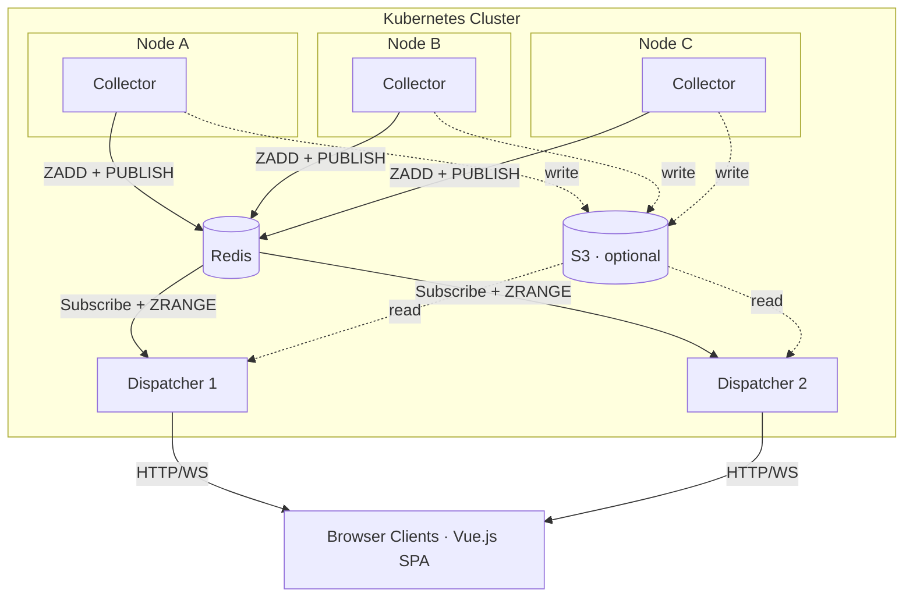

# Flume

[](https://go.dev/dl/)
[](LICENSE)
[](https://hub.docker.com/r/interpt/flume)

Real-time Kubernetes log collector and dispatcher. Collects container logs from every node, writes them to Redis, and serves them to browser clients via horizontally scalable Dispatcher instances — with optional S3 persistence and automatic retention.

| Light | Dark |
|-------|------|
|  |  |
|  |  |

## Features

- **Kubernetes native** — Collector DaemonSet on every node, scalable Dispatcher Deployment
- **Redis-backed** — sorted sets for timestamp-ordered buffering, pub/sub for live dispatch
- **Horizontally scalable** — run multiple Dispatcher replicas behind a load balancer
- **CRI log parsing** — reads `/var/log/containers/` directly, handles partial lines and log rotation
- **Pod label enrichment** — automatically fetches labels from the Kubernetes API
- **Pattern-based routing** — define label selectors to group logs into independent streams
- **Real-time streaming** — logs delivered via WebSocket with configurable batched flush
- **Label-based filtering** — filter by any label in the UI and server-side via WebSocket
- **Pre-filter scoping** — lock a connection to a subset of logs via URL query params
- **Auth callback** — optional external auth service for WebSocket authorization
- **S3 persistence** — time-partitioned gzipped JSON storage with per-hour manifests
- **Automatic retention** — configure a TTL and Flume deletes expired S3 data hourly
- **JSON detection** — structured log lines are parsed and rendered as collapsible JSON trees
- **Single binary** — frontend embedded via `go:embed`, deploy one container

## Architecture



The **Collector** tails container log files, parses CRI format, assembles partial lines, enriches with pod labels, and writes batches to Redis via an atomic Lua script.

The **Dispatcher** subscribes to Redis pub/sub for live messages, reads sorted sets for buffered history, serves the embedded Vue.js frontend, and optionally reads S3 for older data.

## Quick Start

### Docker

```bash
# Start Redis first
docker run -d --name redis -p 6379:6379 redis:7-alpine

# Start the dispatcher
docker run --rm -p 8080:8080 --link redis interpt/flume:0.2.0 dispatcher --redis-addr redis:6379
```

### Helm

```bash
helm install flume deploy/helm/flume \
  --namespace flume \
  --create-namespace \
  --set redis.addr=redis:6379
```

### From Source

```bash
git clone https://github.com/interpt-co/flume.git && cd flume
make build
./bin/flume dispatcher --verbose --redis-addr localhost:6379
```

## Usage

Flume has two subcommands:

### Dispatcher

The scalable server that reads from Redis and serves the web UI.

```bash
flume dispatcher [flags]
```

| Flag | Default | Description |
|------|---------|-------------|
| `--host` | `0.0.0.0` | Bind address |
| `--port` | `8080` | HTTP port |
| `--redis-addr` | `localhost:6379` | Redis address |
| `--redis-password` | | Redis password |
| `--redis-db` | `0` | Redis database number |
| `--bulk-window-ms` | `100` | WebSocket flush interval (ms) |
| `--s3-bucket` | | S3 bucket for history |
| `--s3-prefix` | | S3 key prefix |
| `--s3-region` | | AWS region |
| `--s3-endpoint` | | Custom S3 endpoint (MinIO) |
| `--auth-url` | | Auth callback URL |
| `--auth-timeout` | `5s` | Auth callback timeout |
| `--verbose` | `false` | Debug logging |

### Collector

Runs as a DaemonSet on every node. Reads container logs and writes them to Redis.

```bash
flume collector --config /etc/flume/config.yaml
```

Collector config YAML:

```yaml
collector:
  logDir: /var/log/containers
  bufferSize: 10000
  verbose: false

  redis:
    addr: redis:6379
    password: ""
    db: 0

  patterns:
    - name: all
      selector:
        matchLabels: {}

  s3:
    bucket: my-log-bucket
    prefix: flume
    region: us-east-1
    flushInterval: 10s
    flushCount: 1000
    retention: 168h
```

## Patterns

Patterns are label-based routing rules. Each pattern gets its own Redis sorted set and S3 partition. A message matching multiple patterns is routed to all of them.

```yaml
patterns:
  - name: all
    selector:
      matchLabels: {}          # matches everything

  - name: production
    selector:
      matchLabels:
        env: production

  - name: api
    selector:
      matchLabels:
        app: api-server
        env: production
```

## Redis Data Model

Per pattern `{p}` with key prefix `flume`:

| Key | Type | Purpose |
|-----|------|---------|
| `flume:{p}:msgs` | Sorted Set | Ring buffer. Score = UnixNano timestamp. |
| `flume:{p}:stream` | Pub/Sub channel | Live message batches for dispatchers. |
| `flume:{p}:label_keys` | Set | Known label keys for this pattern. |
| `flume:{p}:labels:{key}` | Set | Distinct values for a label key. |
| `flume:{p}:stats` | Hash | `message_count`, `buffer_capacity`. |
| `flume:patterns` | Set | All known pattern names. |

Collectors write atomically via a Lua script: ZADD + trim + label index + stats + PUBLISH.

## S3 Persistence

Enable on the collector with the `s3` config block. Logs are written as time-partitioned gzipped JSON chunks with per-hour manifest indexes.

```
{prefix}/{node}/{pattern}/{YYYY}/{MM}/{DD}/{HH}/chunk-{unix_ms}.json.gz
{prefix}/{node}/{pattern}/{YYYY}/{MM}/{DD}/{HH}/manifest.json
```

The dispatcher reads S3 for the `/api/history` endpoint, enabling infinite scroll-back in the UI.

AWS credentials are resolved via the standard SDK chain (env vars, `~/.aws/credentials`, IRSA on EKS).

## Pre-Filtering

Lock a WebSocket connection to a subset of logs via URL query parameters. Pre-filtered keys are excluded from the label dropdown and cannot be overridden.

```
wss://flume.example.com/ws?filter=namespace:production,app:api
```

## Auth Callback

When `--auth-url` is configured, every WebSocket upgrade triggers a POST to the auth service with the requested filters and pattern. The `Authorization` and `Cookie` headers are forwarded. A `?token=` query parameter is also supported for browser WebSocket connections.

See [docs/deployment.md](docs/deployment.md) for details.

## REST API

| Endpoint | Description |
|----------|-------------|
| `GET /ws` | WebSocket for live log streaming |
| `GET /api/status` | Server status and buffer stats |
| `GET /api/labels` | Distinct label keys and values from Redis |
| `GET /api/patterns` | Available patterns and their stats |
| `GET /api/client/load` | Paginate the Redis sorted set |
| `GET /api/history` | Historical messages (Redis + S3 fallback) |

See [docs/api-reference.md](docs/api-reference.md) for the full protocol reference.

## Development

```bash
make build              # Build frontend + backend → bin/flume
make build-frontend     # Build frontend only
make build-backend      # Build backend only
make dev-dispatcher     # Run dispatcher in dev mode (needs local Redis)
make dev-collector      # Run collector with test config
make test               # Run Go tests
make lint               # go vet + golangci-lint
```

Frontend dev server (proxies API calls to a running backend):

```bash
cd web && npm install && npm run dev
```

## Documentation

- [Architecture](docs/architecture.md) — system overview, components, data flow
- [API Reference](docs/api-reference.md) — REST endpoints, WebSocket protocol
- [Deployment](docs/deployment.md) — Helm chart, CLI reference, auth, sizing

## License

MIT — see [LICENSE](LICENSE).
