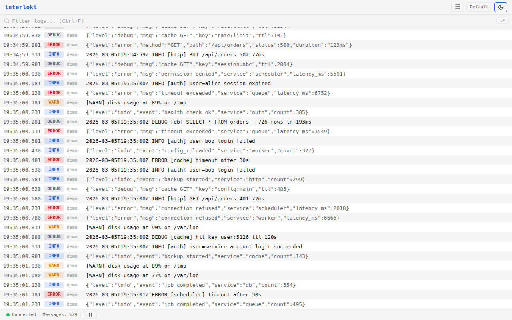
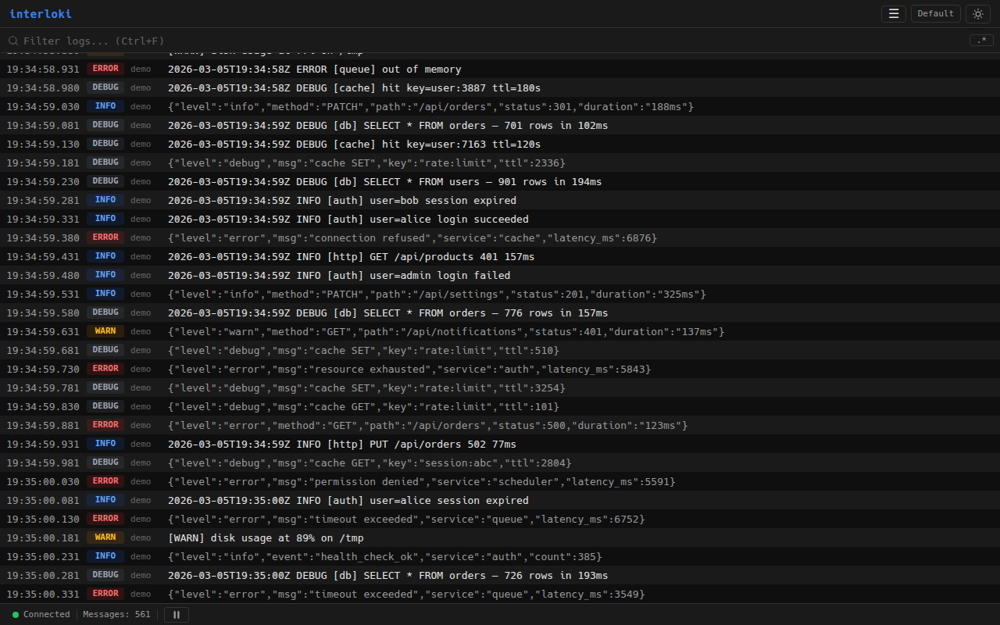
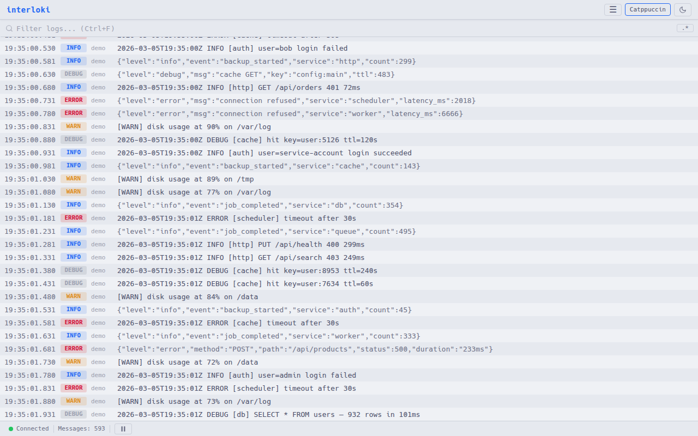
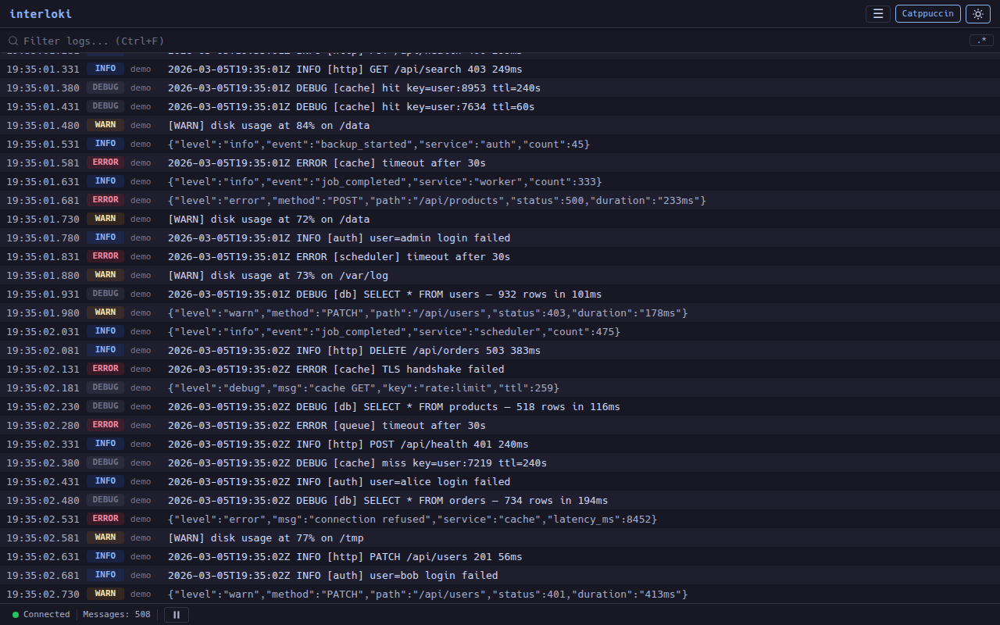

# flume

[](https://go.dev/dl/)
[](LICENSE)
[](https://github.com/interpt-co/flume/actions)

Log aggregator and viewer for distributed systems. Collect logs from multiple sources, filter by labels, and explore them in a real-time browser UI -- with optional S3 persistence and automatic retention.

| Light | Dark |
|-------|------|
|  |  |
|  |  |

## Features

- **Multi-source aggregation** -- combine logs from Fluent Bit forward, TCP sockets, files, and stdin into a single stream
- **Label-based filtering** -- filter logs by labels in real time, both in the UI and on the server via WebSocket
- **S3 persistence with partitioning** -- time-partitioned gzipped JSON storage, optionally partitioned by label for efficient scoped queries
- **Automatic retention** -- configure a TTL and flume deletes expired data from S3 hourly
- **Real-time streaming** -- logs delivered via WebSocket with configurable batched flush
- **JSON detection** -- structured records are parsed and rendered as collapsible JSON trees
- **Ring buffer** -- configurable in-memory history; scroll up to load older entries
- **Single binary** -- frontend embedded via `go:embed`, deploy one file
- **Kubernetes native** -- Helm chart included for per-namespace deployment with Fluent Bit sidecars

## Quick Start

```bash
git clone https://github.com/interpt-co/flume.git && cd flume
make build
./bin/flume demo      # fake logs at 10 msg/s on http://localhost:8080
```

Or with Docker:

```bash
docker run --rm -p 8080:8080 interpt-co/flume demo --rate=50
```

## Source Modes

```bash
# Pipe anything into flume
kubectl logs -f my-pod | flume stdin
journalctl -f | flume stdin

# Follow files
flume follow --file=/var/log/app.log --file=/var/log/worker.log

# Listen on a TCP socket
flume socket --listen=:9999

# Receive from Fluent Bit (Forward protocol)
flume forward --listen=:24224

# Generate demo logs
flume demo --rate=100
```

### Aggregate multiple sources

Run several sources simultaneously and view them in one stream:

```bash
flume aggregate \
  --forward=:24224 \
  --socket=:9999 \
  --file=/var/log/app.log \
  --demo
```

## Label Filtering

When logs carry labels (e.g. from Fluent Bit Kubernetes metadata), flume extracts them and makes them available as clickable filter pills in the UI. Log level is treated as a virtual label.

The filter also applies server-side: only matching messages are sent over the WebSocket, and S3 history queries are scoped to matching partitions when partitioning is enabled.

## S3 Persistence

Enable with `--s3-bucket`. Logs are written as time-partitioned gzipped JSON chunks with per-hour manifest indexes.

```bash
flume forward \
  --s3-bucket=my-logs \
  --s3-prefix=production \
  --s3-region=eu-west-1 \
  --s3-partition-label=namespace \
  --s3-retention=72h
```

Key layout:

```
{prefix}/{YYYY}/{MM}/{DD}/{HH}/chunk-{unix_ms}.json.gz
{prefix}/{YYYY}/{MM}/{DD}/{HH}/manifest.json

# With partition label:
{prefix}/{partition}/{YYYY}/{MM}/{DD}/{HH}/chunk-{unix_ms}.json.gz
```

When `--s3-partition-label` is set, messages are grouped by that label's value. Filtered reads only scan the relevant partition, avoiding full scans.

When `--s3-retention` is set (e.g. `72h`, `7d`), flume automatically deletes expired hour-level prefixes every hour.

AWS credentials are resolved via the standard SDK chain (env vars, `~/.aws/credentials`, IRSA on EKS).

## Configuration

All flags support `FLUME_` environment variable equivalents. Flags take precedence.

| Flag | Default | Description |
|------|---------|-------------|
| `--port` | `8080` | HTTP server port |
| `--host` | `0.0.0.0` | Bind address |
| `--max-messages` | `10000` | Ring buffer capacity |
| `--bulk-window-ms` | `100` | WebSocket flush interval (ms) |
| `--verbose` | `false` | Debug logging |
| `--s3-bucket` | -- | S3 bucket (enables persistence) |
| `--s3-prefix` | -- | Key prefix |
| `--s3-region` | -- | AWS region |
| `--s3-endpoint` | -- | Custom endpoint (MinIO, localstack) |
| `--s3-flush-interval` | `10s` | Max time between S3 flushes |
| `--s3-flush-count` | `1000` | Flush after N buffered messages |
| `--s3-partition-label` | -- | Partition S3 keys by this label |
| `--s3-retention` | `0` | TTL for S3 data (0 = disabled) |

## Kubernetes

The Helm chart deploys flume as a per-namespace pod exposing the web UI (8080) and Forward receiver (24224).

```bash
helm install flume ./deploy/helm/flume/ \
  --namespace my-app \
  --set flume.s3.bucket=my-logs \
  --set flume.s3.prefix=my-app \
  --set flume.s3.region=eu-west-1
```

Point Fluent Bit sidecars at `flume:24224` in the same namespace. See `deploy/helm/flume/values.yaml` for all options.

## REST API

| Endpoint | Description |
|----------|-------------|
| `GET /ws` | WebSocket for live streaming |
| `GET /api/status` | Server status |
| `GET /api/labels` | Distinct label keys and values from the ring buffer |
| `GET /api/client/load?start=N&count=N` | Paginate the ring buffer |
| `GET /api/history?before=RFC3339&count=N&labels=key:val` | Historical messages from S3 |

## Architecture

```
 Source(s)          Pipeline                    Server
 ─────────          ────────                    ──────
 forward ──┐
 stdin   ──┤         parse ─> enrich            WebSocket ──> browsers
 file    ──┼── merge ──> ──> buffer ──> store
 socket  ──┤                    │         │     Ring Buffer
 demo    ──┘                    │         └──>  S3 (optional)
                                └──────────────> clients
```

## Development

```bash
make build            # frontend + backend -> bin/flume
make test             # Go tests
make lint             # go vet + golangci-lint
make dev              # run backend (no frontend build)
```

Frontend dev server: `cd web && npm install && npm run dev` (proxies to a running backend).

## Web Component

The `<flume-viewer>` custom element embeds the log viewer in any page. Build with `cd web && npm run build:wc`.

```html
<script type="module" src="dist-wc/flume-viewer.js"></script>
<flume-viewer ws-url="ws://localhost:8080/ws" theme="dark" height="600px"></flume-viewer>
```

## Inspiration

- **[logdy](https://github.com/logdyhq/logdy-core)** -- single-binary, embedded-frontend architecture
- **[Grafana Loki](https://grafana.com/oss/loki/)** -- label-based log aggregation concept

## License

MIT -- see [LICENSE](LICENSE).
