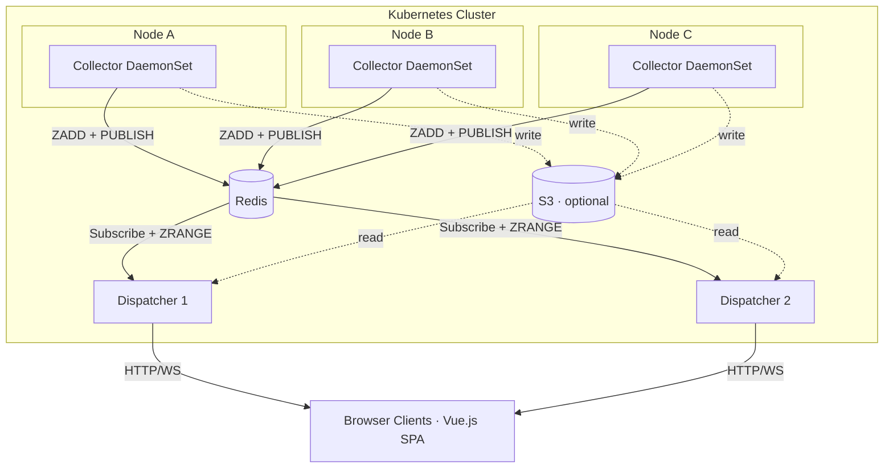
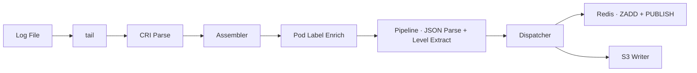
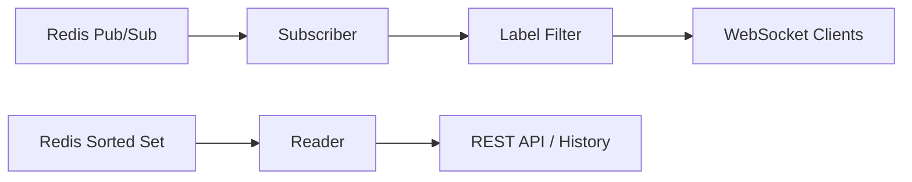

# Flume Architecture

Flume is a real-time Kubernetes log collector and dispatcher. It runs as two components — a **Collector** DaemonSet on every node and horizontally scalable **Dispatcher** Deployments — connected via Redis.

## System Overview



## Components

### Collector (`cmd/flume collector`)

The Collector runs as a DaemonSet on every Kubernetes node. It:

1. **Discovers** container log files in `/var/log/containers/` using `fsnotify`
2. **Tails** each file with `nxadm/tail`, handling log rotation (rename + create)
3. **Parses** CRI log format lines (timestamp, stream, partial flag, content)
4. **Assembles** multi-line partial logs via the CRI Assembler
5. **Enriches** messages with pod labels from the Kubernetes API (via podwatch cache)
6. **Processes** each message through a pipeline (JSON detection, level extraction, ID assignment)
7. **Routes** messages via the Dispatcher to per-pattern destinations: Redis and S3

#### Key Packages

| Package | Purpose |
|---------|---------|
| `internal/collector` | Orchestration: wiring discovery → tail → pipeline → dispatch |
| `internal/collector/discovery` | `fsnotify`-based log file discovery |
| `internal/collector/cri` | CRI log format parser and multi-line assembler |
| `internal/collector/podwatch` | Kubernetes API pod label cache |
| `internal/collector/fanout` | Pattern-based message routing to multiple destinations |

### Dispatcher (`cmd/flume dispatcher`)

The Dispatcher reads from Redis and serves logs to browser clients. It is horizontally scalable — run as many replicas as needed. It:

1. **Subscribes** to Redis pub/sub channels for live message delivery
2. **Reads** Redis sorted sets for buffered message history
3. **Fans out** messages to subscribed WebSocket clients with filtering
4. **Serves** the embedded Vue.js frontend
5. **Provides** REST endpoints for status, labels, patterns, and history
6. **Reads** historical logs from S3 for the `/api/history` endpoint (optional)

#### Key Packages

| Package | Purpose |
|---------|---------|
| `internal/dispatcher` | Orchestration: Redis client + HTTP server wiring |
| `internal/redis` | Redis client, writer (Lua scripts), reader, pub/sub subscriber |
| `internal/server` | HTTP/WebSocket server, client management, auth callback |
| `internal/storage` | S3 persistence: write chunks, read history, retention sweep |

## Data Flow

### Collector Pipeline



### Dispatcher Pipeline



## Redis Data Model

Per pattern `{p}` with configurable key prefix (default `flume`):

| Key | Type | Purpose |
|-----|------|---------|
| `flume:{p}:msgs` | Sorted Set | Ring buffer. Score = UnixNano timestamp. |
| `flume:{p}:stream` | Pub/Sub channel | Live message batches for dispatchers. |
| `flume:{p}:label_keys` | Set | Known label keys for this pattern. |
| `flume:{p}:labels:{key}` | Set | Distinct values for a label key. |
| `flume:{p}:stats` | Hash | `message_count`, `buffer_capacity`. |
| `flume:patterns` | Set | All known pattern names. |

Collectors write atomically via a Lua script that executes in a single Redis transaction:
SADD patterns + ZADD msgs + ZREMRANGEBYRANK trim + SADD label_keys + SADD labels + HINCRBY stats + PUBLISH batch.

## Pattern System

Patterns are label-based routing rules that group log messages. Each pattern:

- Has a **selector** with `matchLabels` (e.g., `app: web, env: production`)
- Maintains its own **Redis sorted set** (configurable capacity via ring trim)
- Has independent **S3 partitioning** (one S3 key prefix per pattern)
- Tracks **subscribers** per dispatcher (WebSocket clients watching this pattern)

The Collector evaluates patterns locally via the Dispatcher. A single log message can match multiple patterns and be routed to all of them.

## WebSocket Protocol

The frontend communicates with the Dispatcher via a JSON-over-WebSocket protocol:

### Server → Client

| Message Type | Description |
|-------------|-------------|
| `client_joined` | Connection established; includes client ID, buffer size, available patterns, pre-filters |
| `log_bulk` | Batch of log messages (flushed at configurable interval, default 100ms) |
| `pattern_changed` | Confirmation of pattern switch with new buffer stats |
| `pong` | Response to client ping |

### Client → Server

| Message Type | Description |
|-------------|-------------|
| `set_status` | Pause (`stopped`) or resume (`following`) live message delivery |
| `set_filter` | Set label filter for server-side message filtering |
| `set_pattern` | Switch to a different pattern |
| `load_range` | Request a range of buffered messages |
| `ping` | Keep-alive ping |

## S3 Storage Layout

```
{prefix}/
  {node}/
    {pattern}/
      {YYYY}/{MM}/{DD}/{HH}/
        chunk-{unix_ms}.json.gz      # Gzipped JSON array of LogMessage
        manifest.json                 # Per-hour index of chunks with metadata
```

The storage layer also supports an optional `PartitionLabel` for grouping by a label value, but this is not currently exposed in the collector configuration.

## Auth Callback

The Dispatcher supports an optional auth callback for WebSocket upgrades:

1. Client connects to `/ws?filter=namespace:prod&pattern=all`
2. Before upgrading, the server POSTs to the configured auth URL with the filter and pattern
3. The auth service returns `{"allowed": true}` or `{"allowed": false, "reason": "..."}`
4. `Authorization` and `Cookie` headers are forwarded from the original request

## Frontend

The Vue.js SPA (`web/src/`) provides:

- **Real-time log viewer** with capped in-memory buffer for smooth performance
- **Pattern selector** for switching between pattern views
- **Label-based filtering** (server-side + client-side)
- **Text/regex search** across log content
- **Pre-filter scoping** via URL query params (`?filter=namespace:prod`)
- **History loading** — infinite scroll up loads older logs from S3
- **JSON syntax highlighting** for structured log messages
- **Dark/light theme** with multiple color palettes
- **Column configuration** (show/hide timestamp, level, source)
